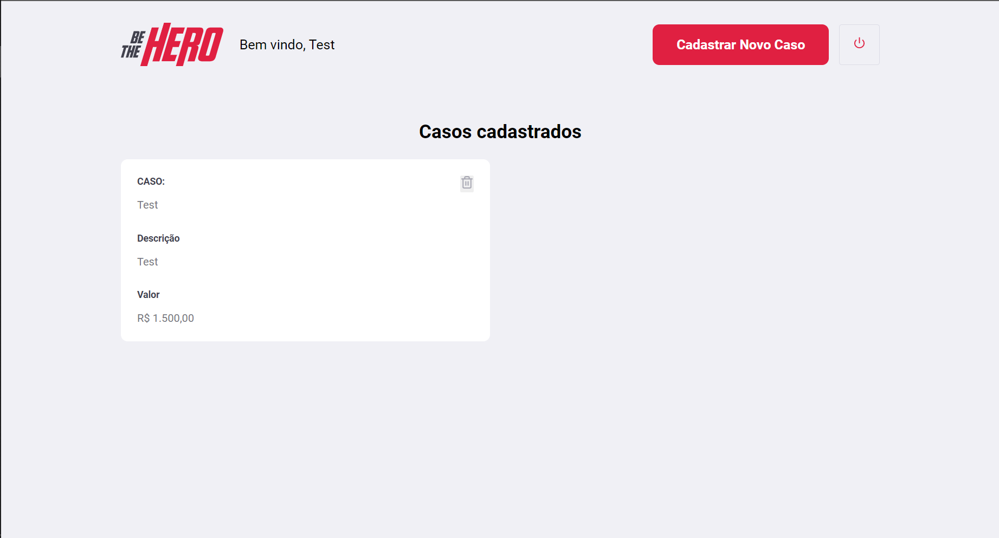
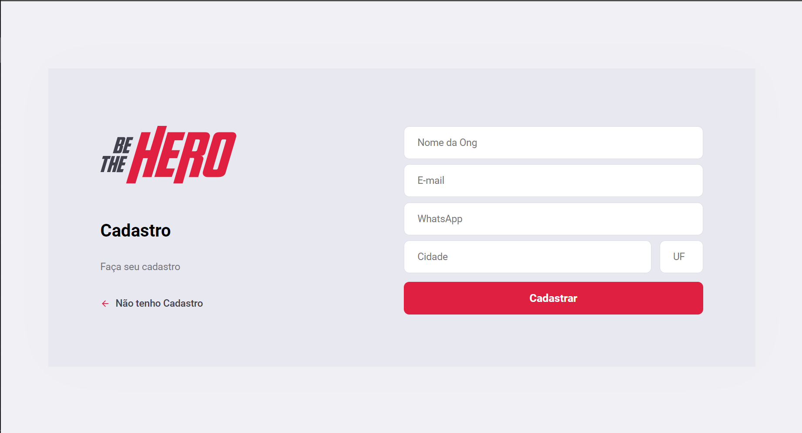

# Semana-omnistack-11

Back end feito em Node js e front end feito em ReactJs

Be the Hero é um projeto feito na semana ommnistack 11 da rockeseat 

Projeto feito para ligar Ongs e pessoas que querem ajudar nos custos 

  
  

